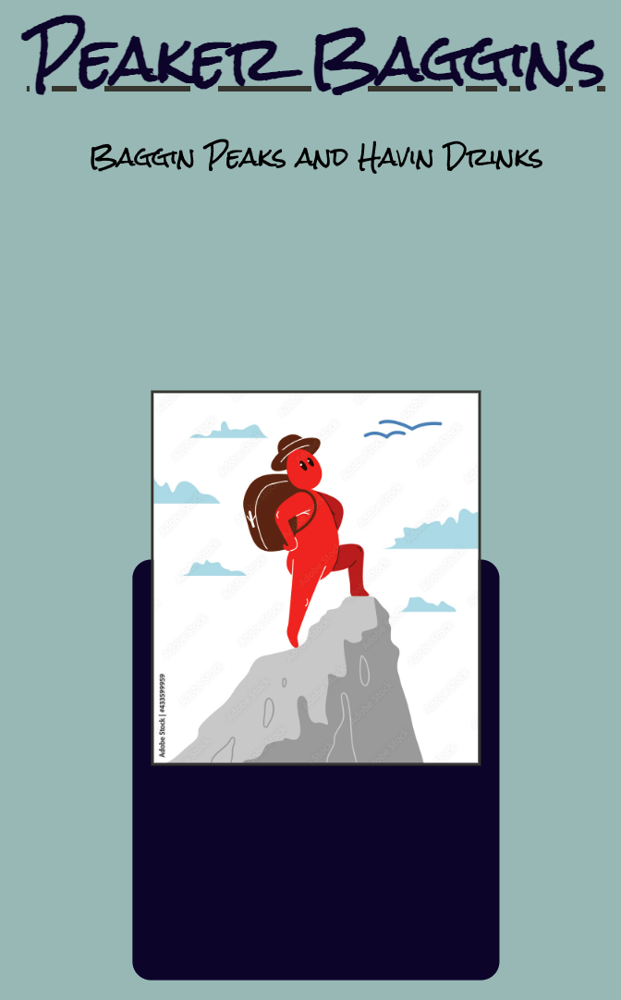
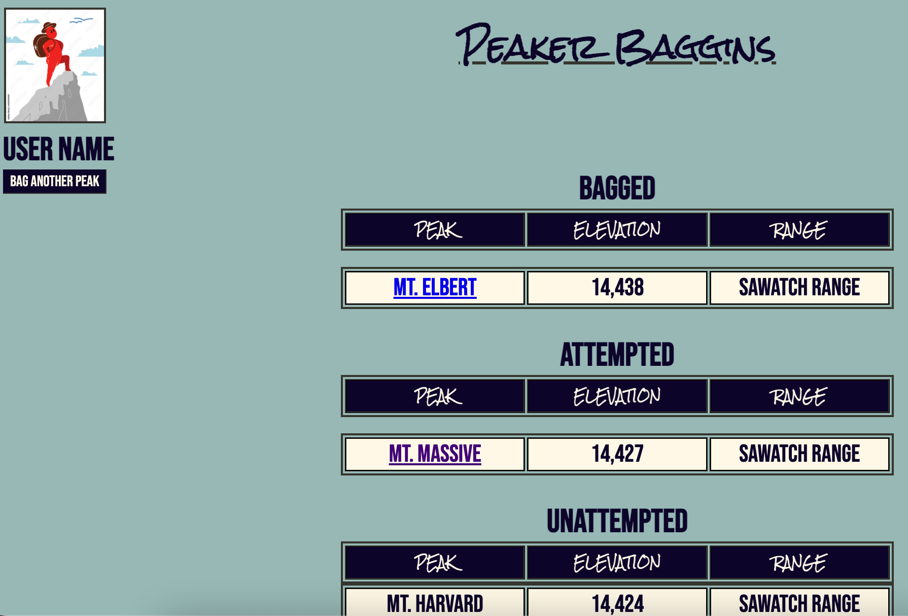
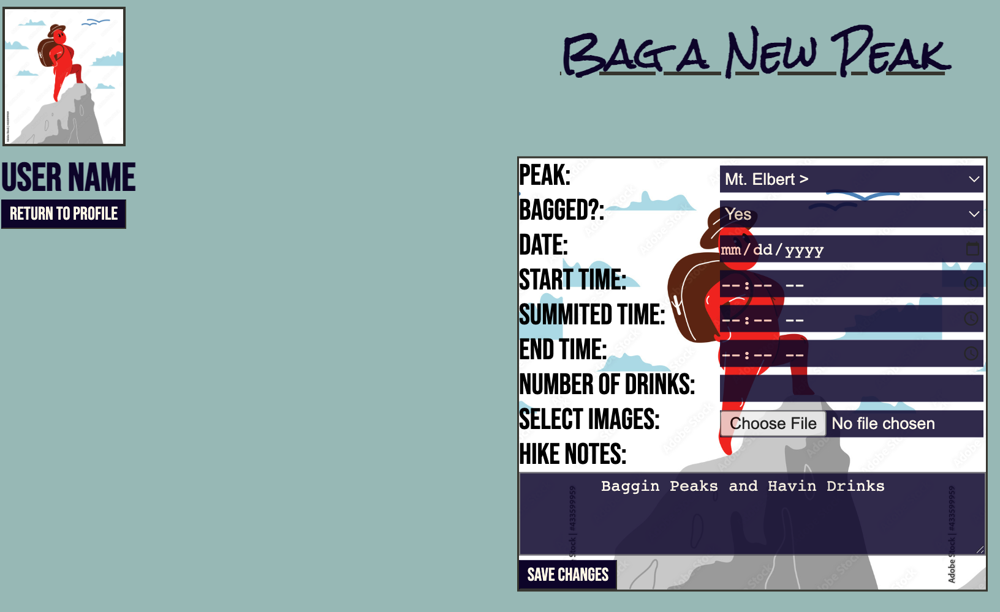
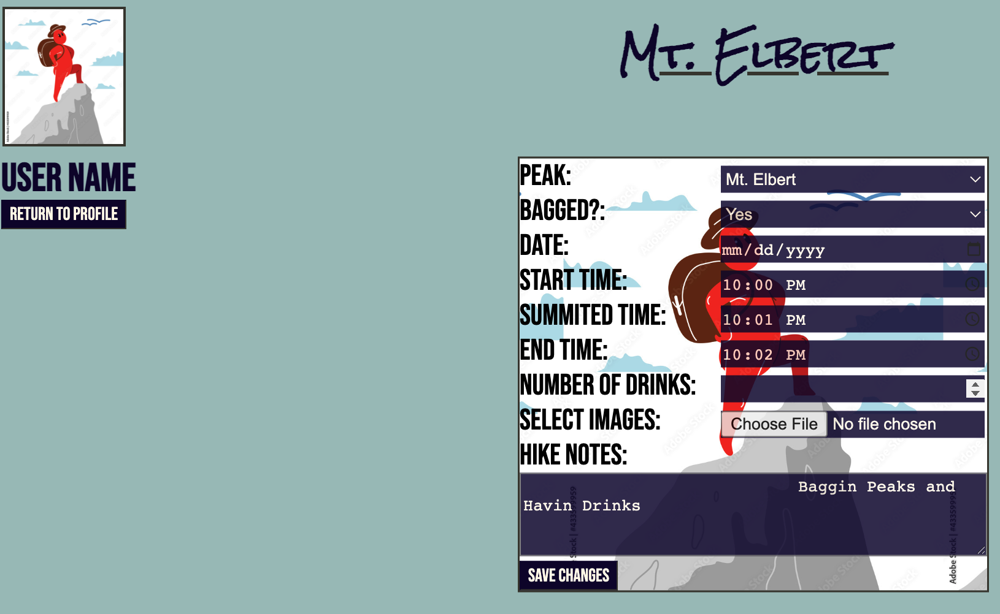
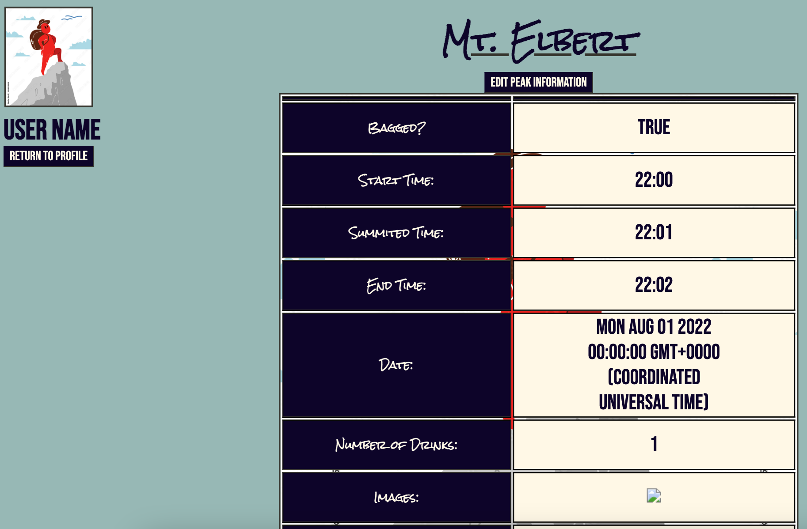

# Peak Tracking App 
An app that allows the user to track the Colorado 14er's they have "Bagged", which ones they have attempted to "Bag" but were unseuccessful, and which 14er's they have not attempted yet.

# User Stories
- As I user I want to check or indicate somehow that I have summited (Bagged) a 14er
- As a user I want to be able to track my start time, my summited time, and my completion time for the hike 
- As a user I want to track what date I hiked the 14er
- As a user I want to be able to include noted about the hike and reference them later
- As a user I want to be able to submit photos from the hike and reference them later
- As a user I want to be able to track the number of drinks that I had on the hike

# Technology Used
- HTML 5
- CSS
- Javascript
- Google Fonts
- Express JS
- Mongoose
- Mongo DB

# Screenshots

# Getting Started
[https://enigmatic-headland-75179.herokuapp.com/] () to use the Peak Tracker 

# Future Enhancements
- Add functionality to upload photos along with Peak information
- Add user login capability using Express Sessions
- Add thumbnail photos of 14ers
- Add functionality that allows users to bag other peaks of Colorado, not just 14ers (13ers etc.)
- Add a google map that shows the peaks location when clicked

